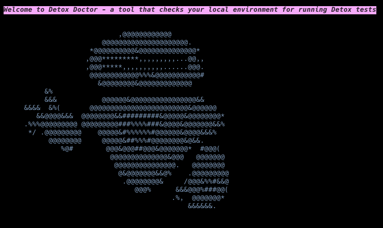

# `detox-doctor`

A simple CLI to check your local environment is ready to run detox tests.

===

Mobile development is tricky, especially when it comes to testing. [Detox](https://github.com/wix/Detox) is a great tool for testing React Native applications, however the setup for your app and local environment is still complicated. This CLI aims to make it easier to see if your machine is ready to run Detox tests.

The idea for this is based off [appium-doctor](https://github.com/appium/appium/tree/master/packages/doctor).

## To install and run globally

- To install it: `npm i -g detox-doctor`
- To see options and help menu: `detox-doctor` or `detox-doctor --help`
- To check your local environment: `detox-doctor check`

## To run locally

- Clone it
- To run it: `node index.js`

### Some stuff I'd like to add:

- Full Windows and Linux support
- Generally just improve handling different environments/shells/etc.
- Add commands to install generic Android emulators from the command line.
- Add checks on your React Native app (would need to pass in a path to the app or run from within the app itself)
